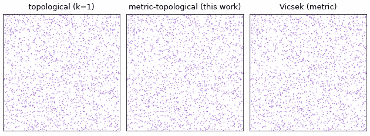
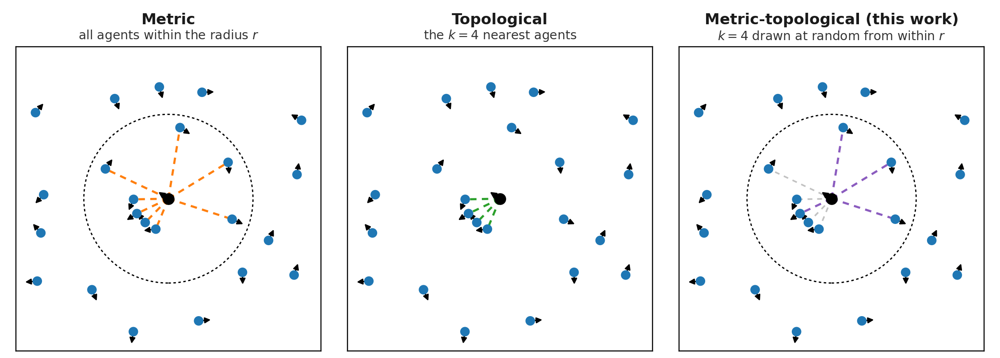
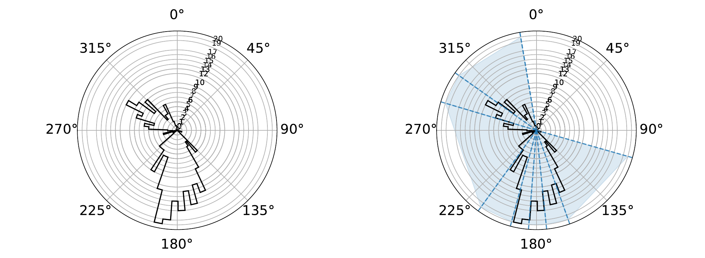
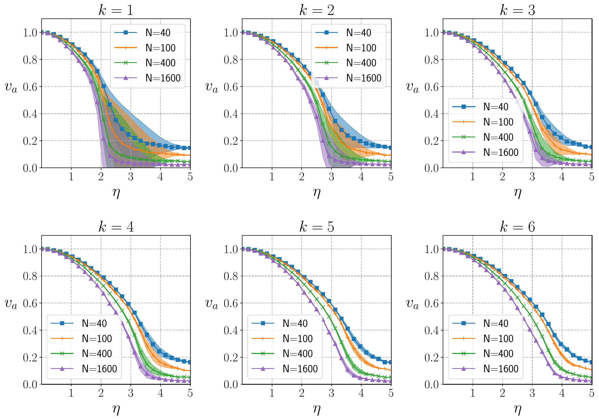
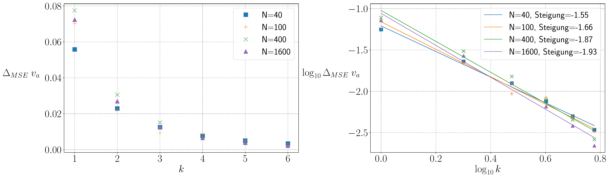
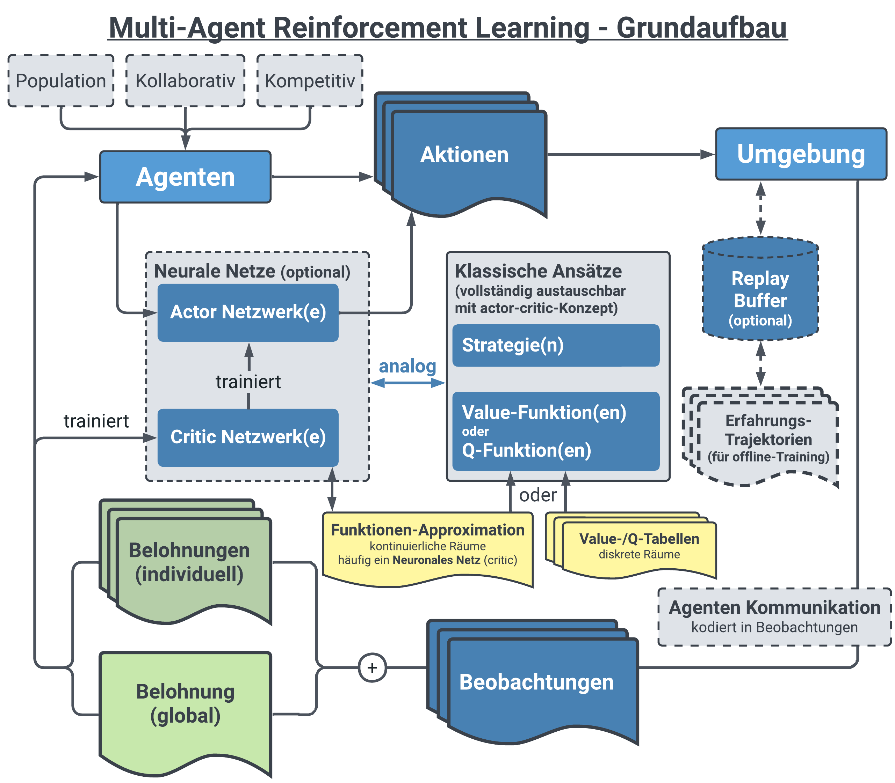
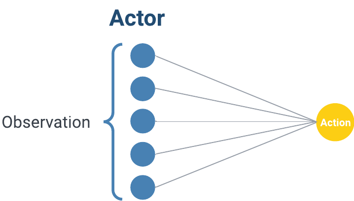
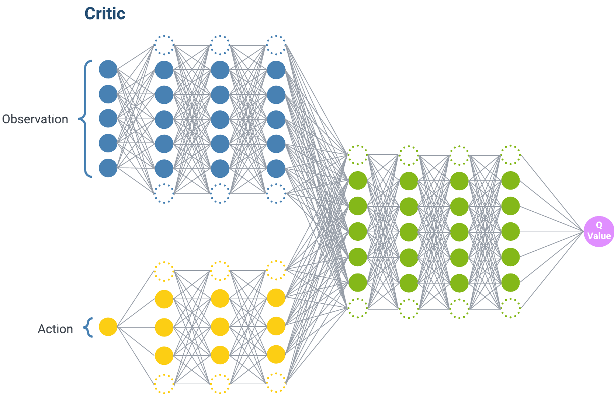

# Neural Swarm Dynamics

**Bachelor thesis in physics, TU Dortmund University (2023)**

How can agents that only see a handful of neighbors still form one coherent swarm?
This thesis studied how local neighbor selection rules generate collective motion, introduced a stochastic **metric-topological neighbor rule** that was evaluated against the classic Vicsek model, and explored an actor-critic **multi-agent reinforcement learning (MARL)** extension whose training remained unsuccessful.

  

Three simulations, identical parameters (N = 2000, noise 0.3), differing only in the neighbor rule.
**Left:** a purely topological rule (k = 1 nearest neighbor) fragments into tiny aligned pairs and never forms a swarm.
**Middle:** the rule introduced in this thesis forms large coherent streams.
**Right:** the metric Vicsek reference. The middle panel behaves like the right one while using only one neighbor per step.

## The idea: sample your neighbors

In the Vicsek model, each agent aligns with the average heading of **all** agents within a radius r (metric rule). Real flocks, however, seem to track a fixed **number** of neighbors k (topological rule), and a fixed input size is also what a neural network needs. But purely topological selection is unstable: in dense spots the k nearest neighbors are all extremely close, interactions become short-ranged, and the swarm collapses into micro-flocks (left panel above).

  

The same neighborhood under the three rules. The metric rule uses everyone inside r. The topological rule spends all four of its slots on one tight cluster, so it only ever sees one direction. The rule introduced in this thesis keeps the radius, then draws its k neighbors at random from everyone inside it, so over time it covers the whole neighborhood while still reading exactly k agents per step (gray links are the candidates not drawn this step).

Where does the random draw come from? Seen from one agent, the neighborhood is a radial histogram of headings. If only k inputs are available, a natural compression is to split that histogram into k regions of equal agent count (k-quantiles, right panel) and average each region:

  

Computing quantiles every step is expensive. The thesis rule gets the same effect statistically:

1. Collect all agents within the metric radius r.
2. Draw **k of them uniformly at random**, resampled every agent and every time step.
3. Apply the ordinary Vicsek average to the sample.

Because the sampled means of sin&thinsp;&theta; and cos&thinsp;&theta; are unbiased estimators of the full-neighborhood means, every update is a **Monte Carlo estimate of the exact Vicsek interaction**, with k as the sample size. That predicts convergence to the Vicsek model as k grows.

## Result: agreement with the Vicsek model

  

Alignment order parameter vs. noise for k = 1 to 6. The shaded tube around each curve is the squared deviation from the metric Vicsek reference; it shrinks rapidly with k and is barely visible at k = 6.

  

The mean squared deviation drops by more than an order of magnitude from k = 1 to k = 6, approximately as a power law in k ("Steigung" = slope). The base Vicsek implementation itself was validated against the original 1995 measurements before any comparison was made.

## The MARL extension (attempted)

The second goal was to replace the hand-written rule with a learned one: use the swarm's order parameter as a global reward and let agents learn alignment themselves. The fixed neighbor count k of the model above exists precisely so that every agent has a constant-size observation vector.

  

  
  &nbsp;&nbsp;&nbsp;
  

The C++ simulation was wrapped as a learning environment (observations: the k sampled neighbor headings; action: a new heading; reward: change of the global order parameter) and trained with an actor-critic pipeline (TF-Agents DDPG; a multi-agent RLlib setup was also explored). The pipeline ran end to end, but **training never produced an interpretable policy**. The main identified issue was the plain scalar encoding of a periodic angle. This part is reported as an honest negative result: it demonstrates early hands-on work with environments, policies, actor-critic networks, and reward design, not a solved RL problem.

## Documents

| Document | Location |
| --- | --- |
| Full thesis (German, 37 pages) | [`latex/thesis/thesis.pdf`](latex/thesis/thesis.pdf) |
| Condensed manuscript (English, 8 pages) | [`latex/manuscript/manuscript.pdf`](latex/manuscript/manuscript.pdf) |
| Defense slides (German) | [`Bachelorvortrag.pdf`](Bachelorvortrag.pdf) |

Both PDFs rebuild with `make` in their respective directories (requires `latexmk` and `biber`).

## Repository notes

This is an archival student research repository from 2023, kept as it was. The simulation core is C++ ([`main/cpp/`](main/cpp/)) with cell-list neighbor search, periodic boundaries, and OpenMP, exposed to Python via pybind11. Analysis and the RL experiments live in [`notebooks/`](notebooks/), an interactive matplotlib front end with live parameter sliders in [`main/python/cppMain.py`](main/python/cppMain.py). Animations were rendered from `.xyz` trajectories with OVITO. Environment: [`env.yml`](env.yml).

C++ &middot; pybind11 &middot; Python &middot; NumPy/Matplotlib &middot; TensorFlow/TF-Agents &middot; RLlib &middot; OVITO
